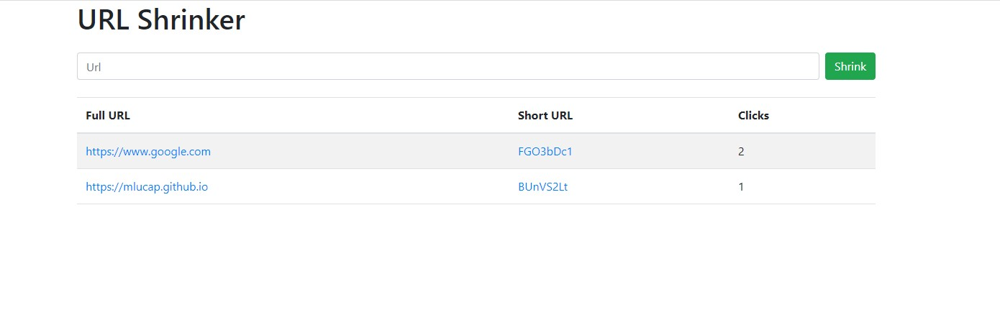

# A simple URL Shortener / redirect link
**Example image**

In this case, `https://google.com` is shortened to `https://domain.xyz/FGO3bDc1` and/or `https://domain.xyz/FGO3bDc1` now redirects `https://google.com`
